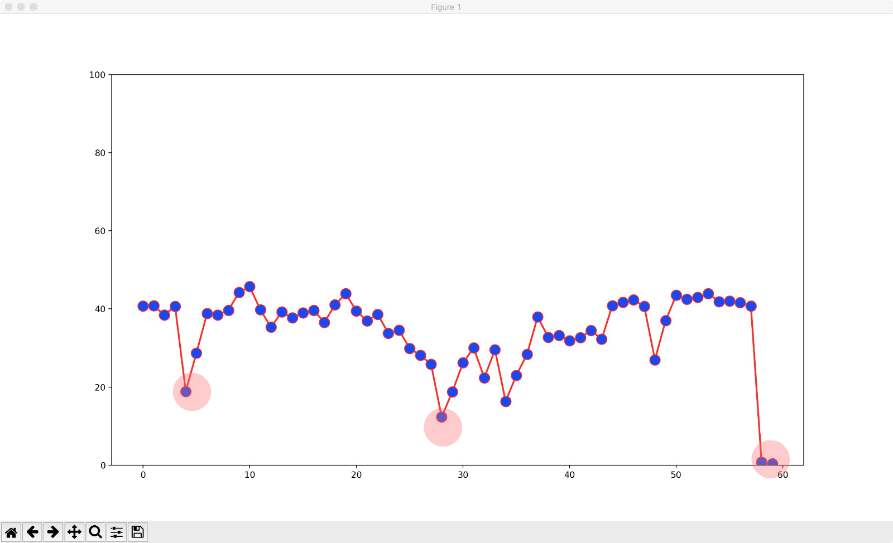
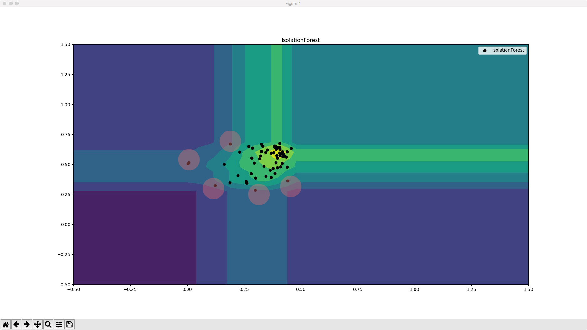
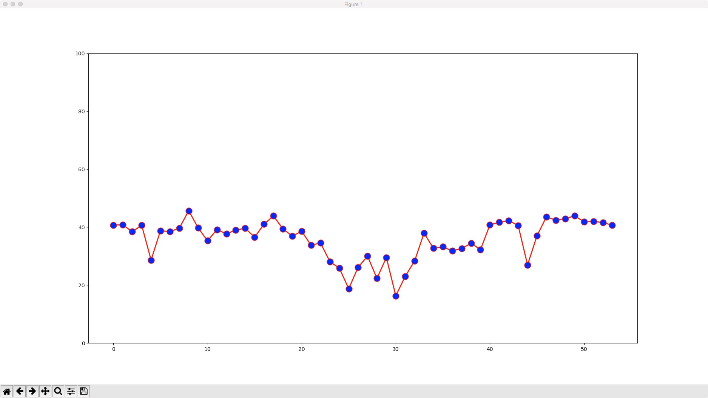
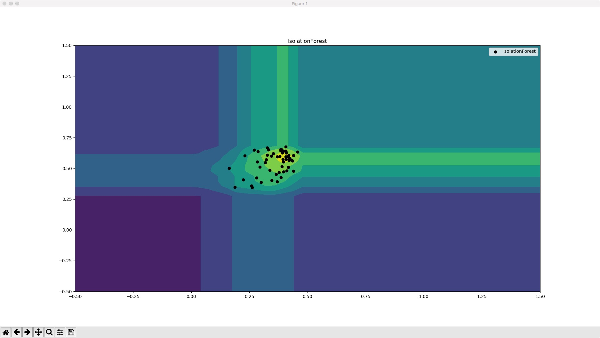

# AnomalyFilter
本项目应用孤立森林异常检测算法，过滤 JMeter 在对 Splunk 数据库进行压力测试过程中产生的异常性能数据  

### 背景
在压力测试和性能分析过程中，通常有两种情形会导致测试结果不准确：  
* 一是由于 JMeter 和 LoadRunner 等工具在启动多线程是有一个爬坡过程，通常需要1-10秒钟左右，这个时间也不会很长。但在这个过程由于线程数量不定，导致了测试数据的可靠性降低。  
* 二是由于现实测试中通常会存在网络异常的情形，极少量的异常值会大大影响对被测对象的性能评估。  

在上述场景中，异常的数据与整个测试数据样本相比是很少的一部分，常见的分类算法例如：SVM、逻辑回归等都不合适。而孤立森林算法恰好非常适合上述场景，首先测试数据具备一定的连续性，其次异常数据具备显著的离群特征，最后异常数据的产生是小概率事件，因此，孤立森林算法在网络安全、交易欺诈、疾病监测等方面也有着广泛的应用。

### 算法简介  
孤立森林算法属非监督学习算法，不需要定义参数模型和进行历史训练样本，通过采用多次迭代的方式构建二叉搜索树(Binary Search Tree)，然后将这些二叉树组成森林，默认二叉搜索树的高度为 8，每 100 棵树组成一个森林，每次最多生成 256 个森林。算法主要构建思想如下：

* 构建二叉树 iTree，首先从训练数据中随机选择 X 个样本，若 iTree 已经 达到限定高度或者仅剩一个样本，则算法收敛。否则，递归构建二叉搜索树，将小于当前根结点的样本放入左子结点，将大于当前根结点的样本放入右子结点。  
```
Algorithm iTree(X,e,h):

Input: X-input data; e-current height; h-height limit; 
Output: an iTree;
if e >= h OR |X| <= 1 then 
    return exNode{Size <- |X|}
else
    //随机选择一个样本 q
    l <- filter(X, q<p)
    r <- filter(X, q>p)
    return inNode{Left <- iTree(l, e+1, h), Right <- iTree(r, e+1, h), SplitAttr q, SplitValue p}
end if
```
* 构建二叉树森林 iForest，根据样本数据容量迭代重复步骤(1)过程创建二叉搜索树 iTree，并将生成的 iTree 组成二叉树森林。  

* 计算森林中二叉树的路径长度，当二叉树森林 iForest 构建完成后，就可以对样本进行预测了，预测过程就是对二叉搜索树进行递归中序遍历，记录从根结点到叶子结点的路径长度 h(x)。
```
Algorithm pathLength(x,T,e): 

Input: x-an instance;
       T-an iTree,
       e-current path length;
Output: path length of x;
if T is an external node then
    return e+c(T.size) //c(n) 为二叉树森林平均路径长度 
end if
//递归中序遍历二叉搜索树 iTree 
a <- T.splitAttr
if x.a < T.splitValue then
    return pathLength(x, T.left, e+1) 
else {x.a >= T.splitValue}
    return pathLength(x, T.right, e+1) 
end if
```
* 计算离群点偏离值，当森林中所有样本路径长度 h(x) 计算完毕后，通过运用统计学的方法计算得出所有数据样本期望值 E(h(x)) 和方差 S(h(x))，进而得到偏离期望和方差的异常数据点。  

常见机器学习聚类算法通常根据空间距离或者密度来寻找异常数据，孤立森林算法独辟蹊径，采用构建二叉树森林再进行中序遍历计算叶子结点平均高度的方式来寻找异常数据，算法实现了对于海量数据的异常检测仅需 O(n) 的线性时间复杂度，能够在短暂的批处理时间间隔内有效检测出离群数据点。

### 数据说明
本项目数据由 JMeter 压测工具生成，包括 CPU.csv 和 HEC.csv 两部分，部分数据形态如下：
#### CPU
```
_time,avg(data.pct_cpu)
2017-10-11T10:49:00.000+0000,40.76111111
2017-10-11T10:50:00.000+0000,40.83888889
2017-10-11T10:51:00.000+0000,38.43333333
2017-10-11T10:52:00.000+0000,40.68333333
2017-10-11T10:53:00.000+0000,18.88947368
2017-10-11T10:54:00.000+0000,28.67083333
2017-10-11T10:55:00.000+0000,38.81666667
2017-10-11T10:56:00.000+0000,38.44444444
2017-10-11T10:57:00.000+0000,39.66666667
2017-10-11T10:58:00.000+0000,44.23888889
2017-10-11T10:59:00.000+0000,45.69444444
2017-10-11T11:00:00.000+0000,39.75
2017-10-11T11:01:00.000+0000,35.31666667
2017-10-11T11:02:00.000+0000,39.2
2017-10-11T11:03:00.000+0000,37.70555556
2017-10-11T11:04:00.000+0000,39.02833333
2017-10-11T11:05:00.000+0000,39.62777778
2017-10-11T11:06:00.000+0000,36.55
2017-10-11T11:07:00.000+0000,41.06111111
```

#### HEC (HTTP Event Collector)
```
data.total_bytes_received
671763730
677754550
701697172
688221270
719098094
684303136
700891510
692669626
592801968
388969482
679806578
687663504
667336032
673175360
```

### 运行结果
运行程序：
```
python Detect.py
```

初始数据折线图


初始数据散点图


过滤数据数据


过滤数据散点

